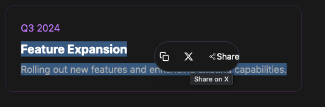

[](https://badge.fury.io/js/social-text-share)
# Social Text Share

Author: Adrian Birsan

Version: 1.0.1

Description: A cool and customizable text selection sharing widget for React applications.


<div align="center">
  
</div>


## Features

- ✨ Beautiful floating UI
- 🎨 Fully customizable theme
- 📱 Responsive design
- ⚡️ Smooth animations
- 🎯 TypeScript support
- 🔧 Custom icons support
- 📢 Event callbacks
- 🌙 Dark mode ready


## Installation

```bash
npm install social-text-share
```

## Usage

```jsx
import { SocialTextShare } from 'social-text-share'
function App() {
return (
<div>
<SocialTextShare
theme={{
background: '#252525',
text: '#ffffff',
border: '#374151',
hoverBg: 'rgba(255, 255, 255, 0.1)'
}}
onShare={(text, platform) => {
console.log(Shared "${text}" on ${platform})
}}
/>
<p>Select any text on this page to see the social share widget!</p>
</div>
)
}
```

### Theme Options

```typescript
interface Theme {
background?: string // Background color of the widget
text?: string // Text color
border?: string // Border color
hoverBg?: string // Hover background color for buttons
}
```

### Custom Icons

```typescript
interface CustomIcons {
copy?: React.ReactNode // Custom copy icon
twitter?: React.ReactNode // Custom twitter icon
share?: React.ReactNode // Custom share icon
}
```


## 🤝 Contributing

Contributions are welcome! Feel free to:
- Report bugs
- Suggest new features
- Submit pull requests

Check our [GitHub Issues](https://github.com/novusweb3/social-text-share/issues) for planned features or to report bugs.

## 📝 License

MIT © Adrian Birsan
